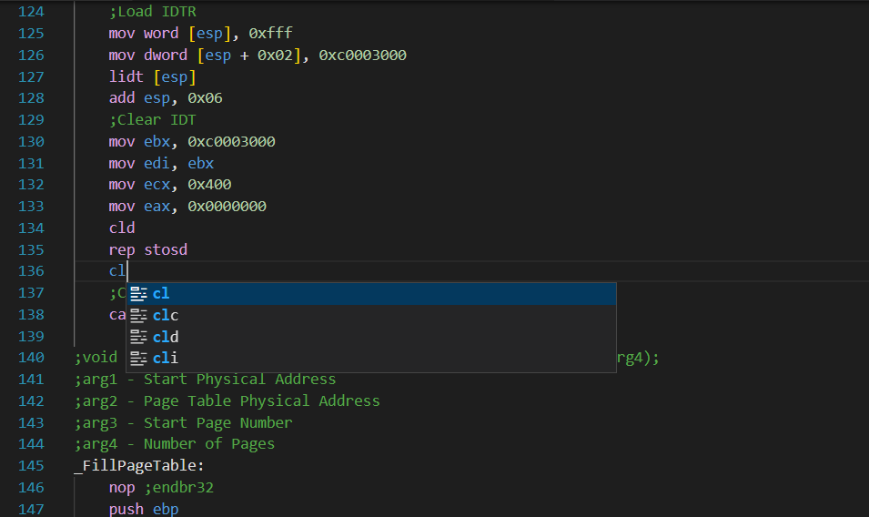

# NASM X86 Assembly Language README

Support NASM x86 assembly language.

## Features

Highlight, autocompletion.

## Requirements

The version of Visual Studio Code must be greater or equal to 1.78.0

## Release Notes

### 0.0.1

Initial release of NASM X86 assembly language plugin.

### 0.0.2

- Highlight for preprocessors
- Identation